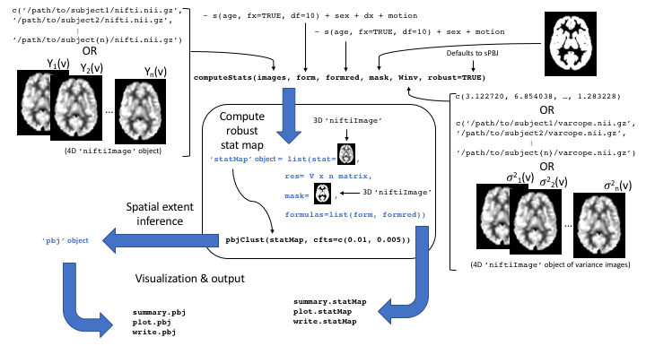

```{r setup, include = FALSE}
knitr::opts_chunk$set(
  collapse = TRUE,
  comment = "#>",
  cache=TRUE
)
```

## The PBJ hypothesis testing procedures
Spatial extent inference (SEI) is a widely used tool in neuroimaging to perform group level analysis where neuroimaging data are modeled as a function of subject level covariates such as age, sex, diagnosis, and/or other phenotypes.
The parametric bootstrap joint (PBJ) testing procedure and the semi-PBJ (sPBJ) procedure are recently proposed methods to perform SEI that relax the assumptions of gaussian random field (GRF) and permutation based methods.
For a detailed overview of these procedures please see XX REF.

The PBJ and sPBJ procedures conceptualize a group level analysis as the second level in a multilevel model; both allow the user to specify subject specific weights that can be defined as images (e.g. varcopes from fsl) or as a scalar value for each subject.
An optimal decision for the weight for subject $i$ at voxel $v$ is the inverse of subject $i$'s variance at location $v$, call it $\sigma^{-2}_i(v)$.
The PBJ procedure assumes that the weights the user passes are exactly equal to $\sigma^{-2}_i(v)$.
However, most of the time, $\sigma^{-2}_i(v)$ is unknown.
As a solution, the sPBJ procedure uses a robust "sandwich" covariance estimator that provides consistent estimates of the standard errors, even if the estimates of $\sigma^{-2}_i(v)$ are misspecified.

The sPBJ SEI procedure is appropriate for any type of group level analysis and has been demonstrated to be robust at cluster forming thresholds (CFTs) where GRF-based methods fail.

## Overview of this vignette
To demonstrate how to use the pbj package, we utilize data from Maumet et al. (2016) to perform a meta-analysis of statistical maps from 21 pain studies [@maumet_sharing_2016; @gorgolewski_neurovault.org:_2015].
This vignette will take you through the process of computing a robust statistical meta-analytic map from the results of the 21 pain studies, performing inference on the maps using the PBJ and sPBJ procedures, and saving and visualizing the results.
Note, this the `pbj` analysis package was designed for group level models where the input data can be subject or study level data.
This tutorial assumes you have fully processed study (or subject) level imaging data.
Preprocessing can be done using other tools in `R` [@muschelli_neuroconductor:_2018].

### Functions and objects overview




## Computing statMaps

### loading in the data
The first step is to gather the files we need to perform the analysis.
This is the hardest part; passing the necessary files to the `computeStats` function produces a `statMap` object which retains all of the objects we need to perform SEI and visualization.
First, we install the packages we need.
The pain21 package includes cleaned data from the "21 Pain Studies" [Neurovault repository](https://neurovault.org/collections/1425/) [@maumet_sharing_2016].
```{r, results='hide', message=FALSE, cache=FALSE}
# install latest version of packages
devtools::install_github('simonvandekar/pain21')
devtools::install_github('simonvandekar/pbj')
```

The `pain21` function from the `pain21` package creates a data frame with file paths for the imaging data that we need to perform the analysis.
The following images are required to perform the analysis:

* The `mask` image is a binary image indicating which voxels should be included in the analysis.
* The character vector of `images` is the contrast image from each study included in the meta-analysis.
* The character vector of `varimages` contains the voxel level estimates of variance from each study.

The `template` is the MNI 152 template and is not necessary to compute the statistical map or perform SEI, but it is handy to include here for visualization in later steps.

```{r}
library(pain21)
pain = pain21()
pain$mask
dirname(pain$data$images[1])
head(basename(pain$data$images))
head(basename(pain$data$varimages))
basename(pain$template)
```

### Computing the statistical map using voxel-wise weights
These data can be passed as arguments to the `computeStats` function.
Since this is a meta-analysis we are performing a one sample t-test, so the full model includes only the intercept and the reduced model is `NULL`.
There are many options with how we pass arguments and analyze the data.
As a first pass, let's do the best thing and use the inverse of the variance images as weights in the regression.
Here, we will specify the outdir argument, which will save the output as nifti images so that the large objects stored in the statMap object are not retained in memory.
Using voxel level weights can take a little while because the computation must be performed separately at each voxel.
`computeStats` defaults to using robust variance estimates (utilized by the sPBJ procedure);
this can be changed by setting `robust=FALSE`.
Because we specified the output directory, nifti images of the results are stored in `outdir` and `statmap` includes only character vectors and formulas that point to the files in `outdir`.
The output directory and all parent directories are created automatically by `computeStats`.

```{r, cache=TRUE}
library(pbj)
# setup model equations
form = ~ 1
formred = NULL
outdir = '~/pain_temp'

comptime = system.time(statmap <- computeStats(pain$data$images, form, formred, pain$mask,
                                               data = pain$data, Winv = pain$data$varimages, outdir=outdir))

str(statmap)
```

### <a id="technical_details_return"></a>Computing the statistical map with study-wise (subject-wise) weights
Often, public data sets only include standardized statistical maps; this makes meta-analysis using conventional methods (e.g. mixed effects models) difficult or impossible because the study level variances aren't known.
However, the sPBJ procedure is still valid because it uses robust standard errors, so any weights can be used and the standard errors are still consistent, as long there is a large number of studies (or subjects) used in the analysis.
The best study level weight is one that is a good estimate of the variance for the statistical map for that study. See [below](#technical_details) for technical details.


Let's run this analysis again, instead on scaled versions of the statistical maps.
Instead of voxel-wise weights we'll use weights are that proportional to the sample size for each study.
Because we are now going to pass statistical maps to `computeStats`, we will compute these maps in `R` and pass `niftiImage` objects as arguments to `computeStats`, instead of character vectors.
Note that we are passing the weights using the `W=` argument this time and including the `template` argument for downstream aesthetics.

```{r, cache=TRUE}
# formulas can be passed as strings
form = '~ 1'
formred = NULL

library(RNifti) # NIfTI IO
library(abind)  # to concatenate 4d arrays
# read in contrast images
images = readNifti(pain$data$images)
# read in variance images
varimages = readNifti(pain$data$varimages)

# images gets the statistical images scaled by sample size
images = lapply(1:length(images), function(ind){
  # get stat image
  out = images[[ind]];
  # scale out variance and sample size
  out[ varimages[[ind]]!=0] =  out[ varimages[[ind]]!=0 ] / sqrt(varimages[[ind]][ varimages[[ind]]!=0] * pain$data$n[ind]);
  out})

# don't need these anymore
rm(varimages)

# create 4d nifti image of study level statistical maps
images = updateNifti(do.call(abind, c(images, along=4)), readNifti(pain$template))

# third level analysis of statistical maps
comptimen = system.time(statmapn <- computeStats(images, form, formred, pain$mask,
                                                 template=pain$template, data = pain$data, W = pain$data$n))

str(statmapn)
```

The statistical map with study level weights has a much faster compute time than the voxel-wise weights.
In our paper, for group level analyses of subject level data, motion was a very effective estimate of subject level variance XX REF.
```{r}
print(c('voxel weights'=comptime[3], 'study weights'=comptimen[3]))
```

### Visualizing `statMap` objects

At this point we may want to view the statistical images to see what the results look like at a few different CFTs.

## Performing SEI on the `statMap` objects

### Performing SEI using `pbjClust`
The `statMap` object includes the statistical map and an esimate of the covariance of the statistical map (`statmapn$sqrtSigma`), which can be use to estimate the distribution of the largest cluster size under the null.
This distribution can be used to compute p-values for each cluster.
This step is easy; the `statMap` object contains all of the objects necessary to perform SEI on the statistical map.
The only thing we need to do is specify the CTFs.
The default is `cfts=c(0.01, 0.005)`, which will run the sPBJ procedure at both thresholds.
Because it is a bootstrap procedure the `nboot` argument can be used to control the number of bootstrap samples used.
For this example we use 200 samples, but for a publication a few thousand is more appropriate.
`pbjClust` keeps track of progress while it's running (not shown here).

```{r, results=FALSE}
pbjcomptime = system.time(sPBJ <- pbjClust(statmap, nboot=200))
pbjcomptimen = system.time(sPBJn <- pbjClust(statmapn, nboot=200))
```

The bootstrap time doesn't differ between voxel-wise or study/subject level weights.

```{r}
print(c('voxel weights'=pbjcomptime[3], 'study weights'=pbjcomptimen[3]))
```


### Visualizing and saving pbj objects

## Simulation tools


## Appendix 

### Glossary of acronyms

* CFT - cluster forming threshold. The threshold chosen to binarize the statistical map for spatial extent hypothesis testing.
* PBJ - parametric bootstrap joint (testing procedure).
* sPBJ - semiparametric bootstrap joint (testing procedure). Robust to variance misspecification.
* SEI - spatial extent hypothesis testing. Using threshold contiguous cluster extents to performing inference on a statistical map.

### <a id="technical_details"></a>Technical details for study level weights

Because fMRI data are in arbitrary units, one parameter of interest may be a standardized parameter estimate.
For each study $i=1, \ldots, 21$
$$ \mathbb{E} Z_i = \mathbb{E} \left\{\left(\frac{\hat{\beta}_i}{ \hat{\sigma}_{yi}}\right) \times (X_{ri}^TX_{ri})^{1/2} \right\}
\approx \left(\frac{\beta}{\sigma_{yi}}\right) \times \mathbb{E}\left\{(X_{ri}^TX_{ri})^{1/2} \right\} \approx \left(\frac{\beta}{\sigma_{yi}} \right) \times \sqrt{n_i},$$
where $\sigma^2_{yi}$ is the variance for the subjects $y$ from study $i$, $\beta$ is the unknown parameter, and $X_{ri}$ is the vector for the covariate of interest (pain scale for study $i$).
The first approximation is because the function in the expectation is nonlinear;
also, because scaling $X_{ir}$ differently for each study proportionally changes the scale of $\hat \beta_i$, so we assume that, across data sets, the scaling of $X_{ir}$ is constant so that the expectation $\mathbb{E}\{\hat{\beta}_i\}$ does not depend on $i$, and the scale of $\mathbb{E}\left\{(X_{ri}^TX_{ri})^{1/2} \right\}$ only depends on the sample size.
Because we are assuming $\sigma_{yi}$ are not provided we further assume $\sigma_{yi} = \sigma_y$.

We can obtain estimates of $\frac{\beta}{\sigma_y}$ from
$$
\mathbb{E}n_i^{-1/2}Z_i \approx \left(\frac{\beta}{\sigma_{yi}} \right),
$$
and then weight with $n_i$ since
$$
\text{Var}(n_i^{-1/2} Z_i) = n_i^{-1}.
$$
[Back](#technical_details_return) to "Computing the statistical map with study-wise (subject-wise) weights"

<!-- ## Styles -->

<!-- The `html_vignette` template includes a basic CSS theme. To override this theme you can specify your own CSS in the document metadata as follows: -->

<!--     output:  -->
<!--       rmarkdown::html_vignette: -->
<!--         css: mystyles.css -->

<!-- ## More Examples -->

<!-- You can write math expressions, e.g. $Y = X\beta + \epsilon$, footnotes^[A footnote here.], and tables, e.g. using `knitr::kable()`. -->

<!-- ```{r, echo=FALSE, results='asis'} -->
<!-- knitr::kable(head(mtcars, 10)) -->

<!-- ``` -->

## References