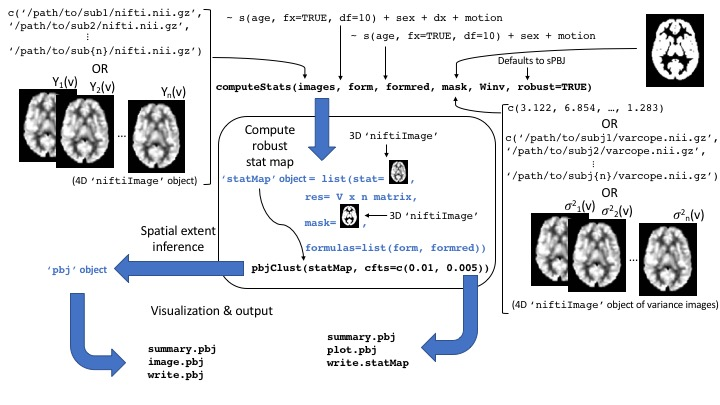

```{r setup, include = FALSE}
knitr::opts_chunk$set(
  collapse = TRUE,
  comment = "#>",
  cache=TRUE
)
```

## Acknowledgements
I am grateful to Shawn Garbett for his help in the preparation and debugging of the `pbj` package and the code and theory for this vignette, as well as other troubling issues I have not yet experienced that he is likely to help me with.


## The PBJ hypothesis testing procedures
Spatial extent inference (SEI) is a widely used tool in neuroimaging to perform group level analysis, where neuroimaging data are modeled as a function of subject level covariates such as age, sex, diagnosis, and/or other covariates.
The parametric bootstrap joint (PBJ) testing procedure and the semi-PBJ (sPBJ) are methods that we recently proposed to perform SEI that relax the assumptions of gaussian random field (GRF) and permutation based methods.
For a detailed overview of these procedures please see [@vandekar_robust_2018].

The PBJ and sPBJ procedures conceptualize a group level analysis as the second level in a multilevel model; both allow the user to specify subject specific weights that can be defined as images (e.g. varcopes from fsl) or as a scalar value for each subject.
An optimal decision for the weight for subject $i$ at voxel $v$ is the inverse of subject $i$'s variance at location $v$, call it $\sigma^{-2}_i(v)$.
The PBJ procedure assumes that the weights the user passes are exactly equal to $\sigma^{-2}_i(v)$.
However, most of the time, $\sigma^{-2}_i(v)$ is unknown.
As a solution, the sPBJ procedure uses a robust "sandwich" covariance estimator that provides consistent estimates of the standard errors, even if the estimates of $\sigma^{-2}_i(v)$ are misspecified.

The sPBJ SEI procedure is appropriate for any type of group level analysis and we demonstrated that it is robust at cluster forming thresholds (CFTs) where GRF-based methods fail to control the FWER.

## Overview of this vignette
To demonstrate how to use the pbj package, we utilize data from Maumet et al. (2016) to perform a meta-analysis of statistical maps from 21 pain studies [@maumet_sharing_2016; @gorgolewski_neurovault.org:_2015].
This vignette will take you through the process of computing a robust statistical meta-analytic map from the results of the 21 pain studies, performing inference on the maps using the PBJ and sPBJ procedures, and saving and visualizing the results.
Note, the `pbj` analysis package was designed for group level models where the input data can be subject or study level data.
The tools in this package assume you have fully processed study (or subject) level imaging data.
Preprocessing can be done using other tools in `R` [@muschelli_neuroconductor:_2018].

### Functions and objects overview




## Computing statMaps

### loading in the data
The first step is to gather the files we need to perform the analysis.
This is the hardest part; passing the necessary files to the `computeStats` function produces a `statMap` object which retains all of the objects we need to perform SEI and visualization.
First, we install the packages we need.
The pain21 package includes cleaned data from the "21 Pain Studies" [Neurovault repository](https://neurovault.org/collections/1425/) [@maumet_sharing_2016].

## INSTALLATION

Use these commands:

```
install.packages('devtools')
devtools::install_github('simonvandekar/pain21')
devtools::install_github('simonvandekar/pbj')
```

The `pain21` function from the `pain21` package creates a data frame with file paths for the imaging data that we need to perform the analysis.
The following images are required to perform the analysis:

* The `mask` image is a binary image indicating which voxels should be included in the analysis.
* The character vector of `images` is the contrast image from each study included in the meta-analysis.
* The character vector of `varimages` contains the voxel level estimates of variance from each study.

The `template` is the MNI 152 template and is not necessary to compute the statistical map or perform SEI, but it is handy to include here for visualization in later steps.

```{r}
library(pain21)
pain = pain21()
pain$mask
dirname(pain$data$images[1])
head(basename(pain$data$images))
head(basename(pain$data$varimages))
basename(pain$template)
```

### Computing the statistical map using voxel-wise weights
These data can be passed as arguments to the `computeStats` function.
Since this is a meta-analysis we are performing a one sample t-test, so the full model includes only the intercept and the reduced model is `NULL`.
There are many options with how we pass arguments and analyze the data.
As a first pass, let's do the best thing and use the inverse of the variance images as weights in the regression.
Here, we will specify the outdir argument, which will save the output as nifti images so that the large objects stored in the statMap object are not retained in memory.
Using voxel level weights can take a little while because the computation must be performed separately at each voxel.
`computeStats` defaults to using robust "sandwich" variance estimates (utilized by the sPBJ procedure);
this can be changed by setting `robust=FALSE`.
Because we specified the output directory, nifti images of the results are stored in `outdir` and `statmap` includes only character vectors and formulas that point to the files in `outdir`.
The output directory and all parent directories are created automatically by `computeStats`.

```{r, cache=TRUE}
library(pbj)
# setup model equations
form = ~ 1
formred = NULL
outdir = '~/pain_temp'

comptime = system.time(statmap <- computeStats(pain$data$images, form, formred, pain$mask,
                                               data = pain$data, Winv = pain$data$varimages, outdir=outdir))

statmap
```

The summary output gives us an idea of the data we are working with. The `computeStats` function returns a `statMap` object, which contains the following fields:
  * The `stat` object is a 3D nifti file where each voxel is a test statistic for the variable of interest
  * The `sqrtSigma` object is a 4D used to estimate the covariance matrix of the test statistics, which is subsequently used to perform SEI
  * The `mask` object gives the directory to the mask file passed as input
  * Because we did not specify a template file it does not exist in the output

### <a id="technical_details_return"></a>Computing the statistical map with study-wise (subject-wise) weights
Often, public data sets only include standardized statistical maps; this makes meta-analysis using conventional methods (e.g. mixed effects models) difficult or impossible because the study level variances aren't known.
However, the sPBJ procedure is still valid because it uses robust standard errors, so any weights can be used and the standard errors are still consistent, as long there is an adequate number of studies (or subjects) used in the analysis.
The best study level weight is one that is a good estimate of the variance for the statistical map for that study.
However, let's see how inference changes if we don't have the variance images, but assume instead that the variance of the estimate from each study is proportional to the square root of the sample size.
The details are not critical to understanding how to use the package, but feel free to see [below](#technical_details) for more information.

Let's run this analysis again, instead on scaled versions of the statistical maps.
Instead of voxel-wise weights we'll use weights are that proportional to the sample size for each study.
Because we are now going to pass statistical maps to `computeStats`, we will compute these maps in `R` and pass `niftiImage` objects as arguments to `computeStats`, instead of character vectors.
Note that we are passing the weights using the `W=` argument this time because the weights are assumed to be approximately inversely proportional to the variance.
We include the `template` argument here for downstream aesthetics.

```{r, cache=TRUE}
# formulas can be passed as strings
form = '~ 1'
formred = NULL

library(RNifti) # NIfTI IO
library(abind)  # to concatenate 4d arrays
# read in contrast images
images = readNifti(pain$data$images)
# read in variance images
varimages = readNifti(pain$data$varimages)

# images gets the statistical images scaled by sample size
images = lapply(1:length(images), function(ind){
  # get stat image
  out = images[[ind]];
  # scale out variance and sample size
  out[ varimages[[ind]]!=0] =  out[ varimages[[ind]]!=0 ] / sqrt(varimages[[ind]][ varimages[[ind]]!=0] * pain$data$n[ind]);
  out})

# don't need these anymore
rm(varimages)

# create 4d nifti image of study level statistical maps
images = updateNifti(do.call(abind, c(images, along=4)), readNifti(pain$template))

# third level analysis of statistical maps
comptimen = system.time(statmapn <- computeStats(images, form, formred, pain$mask,
                                                 template=pain$template, data = pain$data, W = pain$data$n))

statmapn
```

The statistical map with study level weights has a much faster compute time than the voxel-wise weights.
This is because the voxel-wise weights require inverting a matrix at each location in the mask, whereas the study level weights only need to invert one matrix.
In our paper, for group level analyses of subject level data, motion was a very effective estimate of subject level variance [@vandekar_robust_2018].
We will see here that our (somewhat arbitrary) sample size approximation leads to reductions in power.


```{r}
print(c('voxel weights'=comptime[3], 'study weights'=comptimen[3]))
```

### Visualizing and saving `statMap` objects

At this point we may want to view the statistical images to see what the results look like at a few different CFTs.
We can do this using `statMap` method for the `image` function.
The default threshold for visualization is 2.32, which is a one-sided p-value of approximately 0.01.
```{r, eval=FALSE}
image(statmap)
image(statmapn)
```

```{r, fig.width=3.4, fig.height=2.5, fig.cap="A comparison of using voxel-wise level standard error estimates for parameter estimates versus using study-level standard error estimates based on sample size.", echo=FALSE}
image(statmap)
image(statmapn)
```

We can see from the maps that using voxel-level weights appears to be more powerful: there are more extreme thresholds.
Because we did not specify a template image for the first analysis, image defaults to plotting on the mask image.
If no mask image is passed then `pbjClust` will error.

I like to view other slices for subcortical structures:
```{r, eval=FALSE}
image(statmap, plane='coronal')
image(statmapn, plane='sagittal')
```

```{r, fig.width=3.4, fig.height=2.5, fig.cap="Other image views.", echo=FALSE}
image(statmap, plane='coronal')
image(statmapn, plane='sagittal')
```

the function `write.statMap` can be used to write the output to a directory for later use (e.g. separate visualization or to upload to a public access database).

```{r}
write.statMap(statmapn, outdir='~/pain_results')
```


## Performing SEI on the `statMap` objects

The next step is to perform spatial extent inference to see how likely our results are to have occurred under the global null hypothesis that the image is not associated with the covariate.
In this case, the global null corresponds to the hypothesis that the mean of the study-level images is equal to zero.

### Performing SEI using `pbjClust`
The `statMap` object includes the statistical map (`statmap$stat`) and a matrix that is proportional to an estimate of a square root of the covariance matrix of the statistical map (`statmap$sqrtSigma`). 
The `sqrtSigma` object can be use to estimate the distribution of the largest cluster size under the null using a parametric bootstrap procedure [@vandekar_robust_2018].
This distribution is then used to compute p-values for each cluster.

This step is easy to evaluate because the `statMap` object contains all of the objects necessary to perform SEI on the statistical map.
The only thing we need to do is specify the CTFs.
We have the voxel level map, which we might choose to use a more stringent threshold on to get finer anatomical details, so we might lean towards a CFT of 0.005.
For the study level map we've lost some power with our approximation, so we get anatomically distinct clusters at a lower threshold, so we might lean towards a CFT of 0.01.
The default is to use multiple CFTs, `cfts=c(0.01, 0.005)`, which will run the sPBJ procedure at both thresholds.


Because the PBJ and sPBJ procedures use a bootstrap, the `nboot` argument can be used to control the number of bootstrap samples used.
For this example we use 200 samples, but for a publication a few thousand is more appropriate to reduce the error in the computational approximation.
`pbjClust` keeps track of progress while it's running (not shown here).
We again use `system.time` here to track computing times.


```{r, results=FALSE}
pbjcomptime  = system.time(sPBJ  <- pbjClust(statmap,  nboot=200))
pbjcomptimen = system.time(sPBJn <- pbjClust(statmapn, nboot=200))
```

The bootstrap time doesn't differ between voxel-wise or study/subject level weights.

```{r}
print(c('voxel weights'=pbjcomptime[3], 'study weights'=pbjcomptimen[3]))
```

The `pbjClust` function returns a `pbj` object which contains information about which clusters are large enough to be unlikely to have occurred by chance under the global null.
This object is a list containing the following things:

* `stat` This is the statistical map from the `statMap` object without changes
* `template` This is the template you passed to the `statMap` object
* `cft*` This is a list containing the following:
    + `pvalues` This is a vector of the SEI p-values, ordered relative to space, not value
    + `clustmap` This is a `niftiImage` object of cluster indices where each index in `clustmap` corresponds to that particular index of the vector of SEI p-values
    + `pmap` This is a `niftiImage` object of `-log10(p)` where `p` is the SEI p-value


### Visualizing and saving pbj objects

`pbj` objects can be visualized in the same way as the `statMap` object. The image function takes a desired rejection threshold `alpha` and only plots clusters with cluster-wise p-values below that threshold.

If multiple CFTs were used it produces the images for each of those thresholds.

```{r}
image(sPBJn)
```

The `write.pbj` function can be used to export the the images contained in the `pbj` object.
The cluster and p-value maps are written for every CFT in a standardized format `pbj_sei_log10p_cft*.nii.gz` and `pbj_sei_log10p_cft*.nii.gz`, respectively.

```{r}
write.pbj(sPBJn, '~/pain_results')
```

## Simulation tools

Tools to run simulations as in [@vandekar_robust_2018] are in progress.

## Appendix 

### Glossary of acronyms

* CFT - cluster forming threshold. The threshold chosen to binarize the statistical map for spatial extent hypothesis testing.
* PBJ - parametric bootstrap joint (testing procedure).
* sPBJ - semiparametric bootstrap joint (testing procedure). Robust to variance misspecification.
* SEI - spatial extent inference. Using thresholded contiguous cluster extents to perform inference on a statistical map.

### <a id="technical_details"></a>Technical details for study level weights

Because fMRI data are in arbitrary units, one parameter of interest may be a standardized parameter estimate.
For each study $i=1, \ldots, 21$
$$ \mathbb{E} Z_i = \mathbb{E} \left\{\left(\frac{\hat{\beta}_i}{ \hat{\sigma}_{yi}}\right) \times (X_{ri}^TX_{ri})^{1/2} \right\}
\approx \left(\frac{\beta}{\sigma_{yi}}\right) \times \mathbb{E}\left\{(X_{ri}^TX_{ri})^{1/2} \right\} \approx \left(\frac{\beta}{\sigma_{yi}} \right) \times \sqrt{n_i},$$
where $\sigma^2_{yi}$ is the variance for the subjects $y$ from study $i$, $\beta$ is the unknown parameter, and $X_{ri}$ is the vector for the covariate of interest (pain scale for study $i$).
The first approximation is because the function in the expectation is nonlinear;
also, because scaling $X_{ri}$ differently for each study proportionally changes the scale of $\hat \beta_i$, so we assume that, across data sets, the scaling of $X_{ri}$ is constant so that the expectation $\mathbb{E}\{\hat{\beta}_i\}$ does not depend on $i$, and the scale of $\mathbb{E}\left\{(X_{ri}^TX_{ri})^{1/2} \right\} = O(\sqrt{n_i})$ only depends on the sample size.
Because we are assuming $\sigma_{yi}$ are not provided we further assume $\sigma_{yi} = \sigma_y$.

We can obtain estimates of $\frac{\beta}{\sigma_y}$ from
$$
\mathbb{E}n_i^{-1/2}Z_i \approx \left(\frac{\beta}{\sigma_{yi}} \right),
$$
and then weight with $n_i$ since
$$
\text{Var}(n_i^{-1/2} Z_i) = n_i^{-1}.
$$
[Back](#technical_details_return) to "Computing the statistical map with study-wise (subject-wise) weights"

<!-- ## Styles -->

<!-- The `html_vignette` template includes a basic CSS theme. To override this theme you can specify your own CSS in the document metadata as follows: -->

<!--     output:  -->
<!--       rmarkdown::html_vignette: -->
<!--         css: mystyles.css -->

<!-- ## More Examples -->

<!-- You can write math expressions, e.g. $Y = X\beta + \epsilon$, footnotes^[A footnote here.], and tables, e.g. using `knitr::kable()`. -->

<!-- ```{r, echo=FALSE, results='asis'} -->
<!-- knitr::kable(head(mtcars, 10)) -->

<!-- ``` -->

## References
